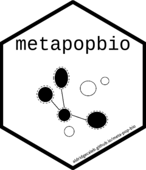

# metapopbio <a href="https://aldridgecaleb.github.io/meta-pop-bio/"></a>
# metapopbio: Construction and Analysis of Metapopulation Models
## Pacage Description
The [`metapopbio`](https://github.com/AldridgeCaleb/meta-pop-bio) package is inspired by and complements the fuctionalities of the [`popbio`](https://cran.r-project.org/web/packages/popbio/index.html) package. Users can construct and analyze projection matrix models for metapopulations classified by age or stage and located in distinct patches.

The functionality to date is largely based on Hunter and Caswell (2005) to construct and analyze spatial matrix population models using the vec-permutation matrix. This model extends the Leslie matrix (Leslie 1945) to include dispersal rates between patches. An analogous approach was taken by Lebreton (1996) and called the "renewal equation approach."

## Installation
```r
install.packages(devtools)
devtools::install_github("AldridgeCaleb/meta-pop-bio")
library(metapopbio)
```

## Usage (placeholder)

## Support
Please report issues or bugs to https://github.com/AldridgeCaleb/meta-pop-bio/issues or email caleb.a.aldridge at gmail.com

## Roadmap
Current plans include support for classic metapopulation models of Gotelli (1991; 2008) *and others* (e.g., mainland--island model, internal colonization, and rescue effect) and hyperstate matrix models (Roth and Caswell 2016). Additionally, Hanski's (1994) incidence function and a metapopulation version of the **S**usceptible--**I**nfected--**R**ecovered model (SIR model) are also being considered. Other suggestions can be submitted in email to caleb.a.aldridge@gmail.com or as an issue on the package's GitHub repository (https://github.com/AldridgeCaleb/meta-pop-bio/issues).

## Contributing

Contributions to this code are welcome. Please contact Caleb A. Aldridge (caleb.a.aldridge at gmail.com) with a brief summary of potential contributions. 

## Authors and acknowledgment

### Authors

* Caleb A. Aldridge (caleb.a.aldridge at gmail.com)

### Maintainer

* Caleb A. Aldridge (caleb.a.aldridge at gmail.com)

### Acknowledgements

*Pending.*

## License

The GNU General Public License v3.0 (GPL-3.0) is a free software license that allows users to freely use, modify, and distribute the software. The key stipulation is that any derivative work must also be distributed under the same GPL-3.0 license. This ensures that modifications remain open-source. The license also provides explicit patent grants and protections against tivoization, a practice that restricts users from modifying running software on their own devices.

**See full license description [here](https://choosealicense.com/licenses/gpl-3.0/).**

## Project status

**In progress**

## References
Caswell, H. (2001). Matrix Population Models: Construction, analysis, and 
interpretation (2nd ed.). Sinauer Associates.

Gotelli, N. J. (1991). Metapopulation models: the rescue effect, the propagule rain, and the core-satellite hypothesis. *The American Naturalist* 138(3):768--776.

Gotelli, N. J. (2008). A Primer of Ecology (4th ed.). Sinauer Associates.

Hunter, C. M. and Caswell, H. (2005). The use of vec-permutation matrix in spatial matrix population models. *Ecological Modelling* 188:15--21.

Lebreton, J. D. (1996). Demographic models for subdivided populations: the renewal equation approach. *Theoretical Population Biology* 49:291--313.

Leslie, P. H. (1945). On the use of matrices in certain population mathematics. *Biometrika* 33:183–212.

Morris, W. F., and Doak, D. F. (2003). Quantitative Conservation Biology: Theory and practice of population viability analysis. Sinauer Associates.

Roth, G. and Caswell, H. (2016). Hyperstate matrix models: extending demographic state spaces to higher dimensions. *Methods in Ecology and Evolution* 7:1438--1450.

Wootton, J.T., and Bell, D.A. (1992). A metapopulation model of the peregrine falcon in California: viability and management strategies. *Ecological Applications* 2:307--321.
